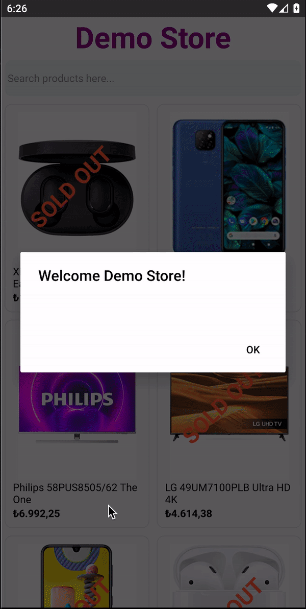

  <h1 align="center">NEWS APP</h1>
<p align="center" >


</p>
<hr/>

<!-- TABLE OF CONTENTS -->
<details open="open">
  <summary>Table of Contents</summary>
  <ol>
    <li><a href="#about-the-project">About The Project</a></li>
    <li><a href="#built-with">Built With</a></li>
    <li><a href="#reviewed-topics">Reviewed Topics</a></li>
    <li><a href="#roadmap">Roadmap</a></li>
    <li><a href="#clone-the-repo">Clone The Repo</a></li>
    <li><a href="#contributing">Contributing</a></li>
    <li><a href="#contact">Contact</a></li>
    
  </ol>
</details>


<!-- ABOUT THE PROJECT -->
## About The Project
This project is my very first practice example of React Native.

It is a prototype of a News Mobile App project. Customer can see flash news from this app.


## Built With

* [React Native](https://reactnative.dev/)  

## Reviewed Topics

* React Native;
    - Functional Components,
    - Custom Components,
    - FlatList, TouchableOpacity Built-in Components
    - Basic Styling


## Roadmap
<pre>
src
   |- components
   |           |- index.js
   |           |- NewsBanner.js
   |           |- NewsCard.js
   |
   |- News.js
   
</pre>


## Clone The Repo
   ```sh
   git clone https://github.com/Hasan-Metin/NewsApp.git
   ```

## Contributing

Contributions are what make the open source community such an amazing place to be learn, inspire, and create. Any contributions you make are **greatly appreciated**.

1. Fork the Project
2. Create your Feature Branch (`git checkout -b feature/AmazingFeature`)
3. Commit your Changes (`git commit -m 'Add some AmazingFeature'`)
4. Push to the Branch (`git push origin feature/AmazingFeature`)
5. Open a Pull Request


## Contact

Hasan Metin - <a href="mailto: hasan.metinn@outlook.com">hasan.metinn@outlook.com</a>

Project Link: [https://github.com/Hasan-Metin/NewsApp.git](https://github.com/Hasan-Metin/NewsApp.git)


<!-- ACKNOWLEDGEMENTS -->
More feature will be added on soon.

If you have any question or suggestion, feel free to [open an issue](https://github.com/Hasan-Metin/NewsApp/issues).

**See y'all !**

